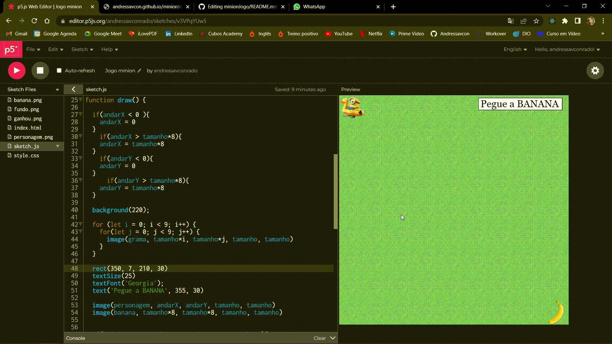

# minionJogo

Primeira aula técnica de Desenvolvimento de Software da Cubos Academy

Praticando um pouco a lógica de programação. 

O jogo funciona levando o minion com as setas do teclado (← ↑ ↓ →) até chegar a Banana!
https://andressavcon.github.io/minionJogo/

